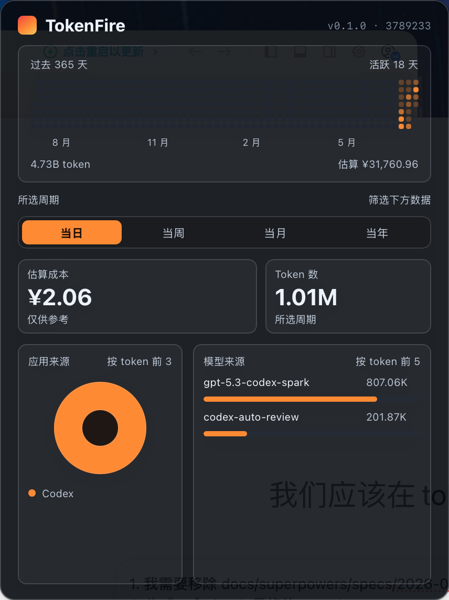

# TokenFire

Local macOS usage profile for AI coding tools. TokenFire runs as a Tauri menu bar utility, ingests token observations from supported tools, and turns them into a compact GitHub-style activity view.



## What It Shows

- A 365-day activity heatmap with active days, token volume, and estimated CNY cost.
- Period filters for today, this week, this month, and this year.
- Selected-period totals for estimated cost and token count.
- Source attribution across TraeX, Codex, Claude, and Cursor.
- Top model attribution by token usage.
- Local hook status and source toggles from the macOS tray menu.

Cost is an estimate for awareness and comparison, not a billing source of truth.

## Architecture

TokenFire is a macOS Tauri v2 app with a React frontend and a Rust backend.

- `src/profile/` renders the profile popover, heatmap, metrics, source breakdown, and model breakdown.
- `src-tauri/src/core/` owns source-independent accounting, pricing, profile aggregation, and SQLite storage.
- `src-tauri/src/adapters/` contains source-specific integrations for TraeX, Codex, Claude, and Cursor.
- `src-tauri/src/app/` wires runtime paths, tray behavior, socket forwarding, hook management, and profile commands.
- `src-tauri/src/bin/token_fire_hook.rs` builds the hook sidecar used by external tool hooks.

Runtime data stays local under `~/.token-fire`, including `token-fire.sqlite`, logs, socket files, backups, and debug bundles.

## Development

```bash
pnpm install
pnpm dev
```

Run the desktop app:

```bash
pnpm tauri dev
```

Build the frontend:

```bash
pnpm build
```

Run frontend tests:

```bash
pnpm test
```

Run Rust tests:

```bash
cargo test --manifest-path src-tauri/Cargo.toml
```

Run the app bundle smoke check:

```bash
scripts/app-bundle-smoke.sh
```

Run the release smoke check:

```bash
scripts/release-smoke.sh
```

## Repository Layout

```text
src/
  app/              React hooks and Tauri command bridge
  profile/          Menu bar profile UI
  design-system/    CSS tokens
src-tauri/
  src/core/         Domain logic and storage
  src/adapters/     Tool-specific ingestion adapters
  src/app/          Runtime orchestration
  src/bin/          Hook sidecar binary
  tests/            Rust integration tests
scripts/            Build and smoke-test helpers
docs/               Specs and README assets
agent-docs/         Long-lived design notes
```

## Notes

- The frontend uses React, TypeScript, and plain CSS variables.
- The backend uses Rust 2021, Tauri v2, and SQLite via `rusqlite`.
- Generated outputs such as `dist/`, `src-tauri/target/`, `src-tauri/bin/`, `.worktrees/`, and `node_modules/` should stay out of git.
